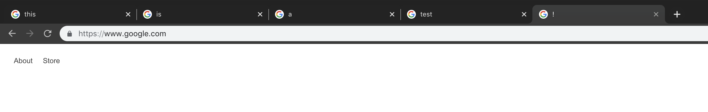
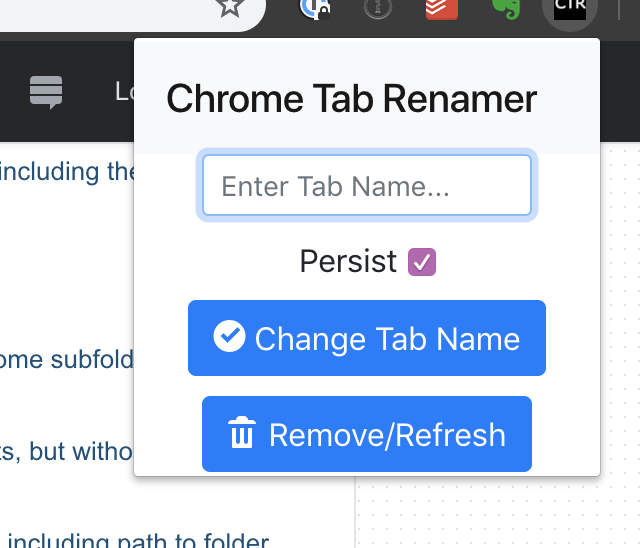
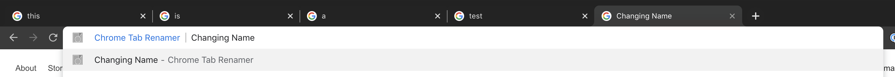
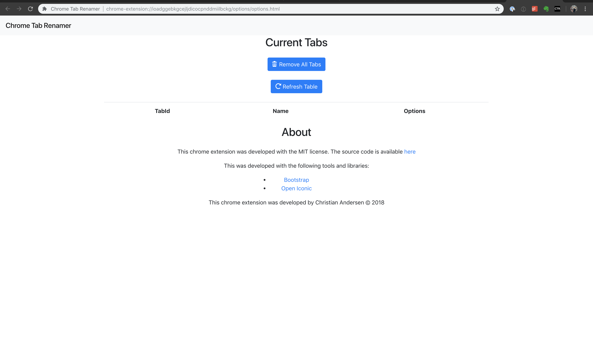

Develop Build: [](https://circleci.com/gh/wcchristian/chrome-tab-renamer/tree/develop)
# Chrome Tab Renamer
A tab renamer extension for google chrome. This extension will allow you 

## Tutorial
For practice, I included the chrome extension tutorial in the tutorial folder of this repo.
[Tutorial Link](https://developer.chrome.com/extensions/getstarted)

# How to use
1. Navigate to a tab that you wish to rename
1. Click the Chrome Tab Renamer extension button.
1. Type the new name for your tab
1. Click the "Change Tab Name" or press enter to rename the tab.

## Omnibox
This chrome extension can make use of the omnibox with the prefix ctr

## Hotkey
The default chrome hotkey is Ctrl/Command+E

## Persistance
By selecting the persist option, this extension will persist your tab rename even if you navigate to a different page in your tab.

Un-selecting this option means that any pageload will remove your option.

## Options
The options menu allows you to view all of your current renames, delete them, clear all of them, etc.

# Screenshots
## Named Tabs



## Title input



## Omnibox Support



## Options Support


# Development
## Build
To build the extension from deployment, run:
```sh
./build.sh
```

To clean the repository from build artifacts, run:
```sh
./clean.sh
```

## Versioning
When adding a new version, make sure to update manifest.json and build.sh